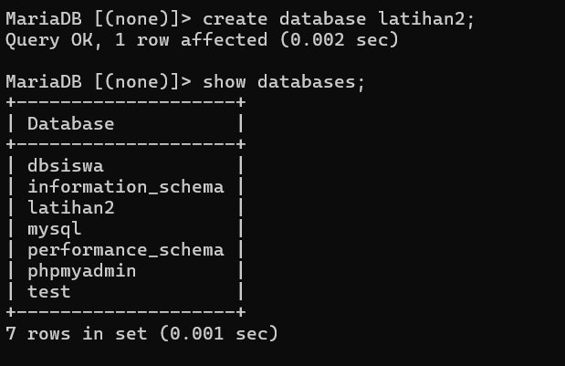
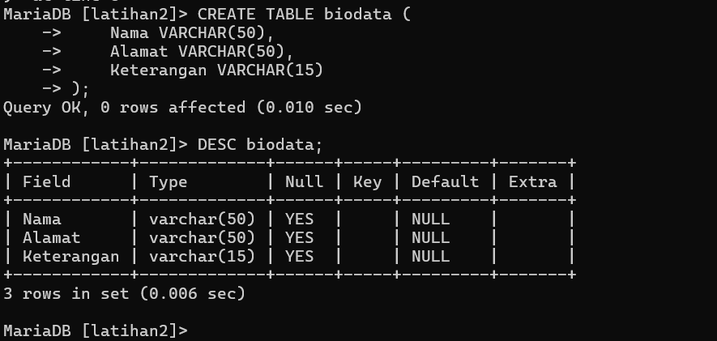
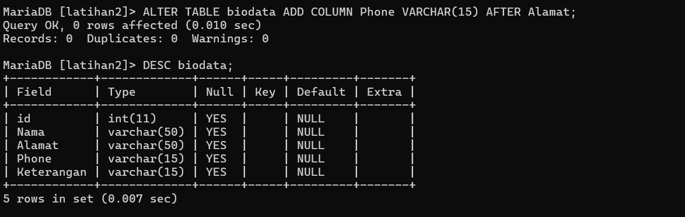
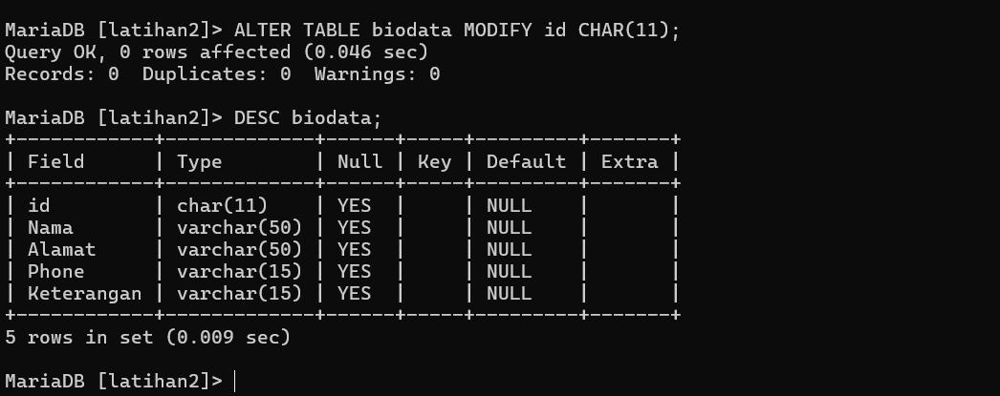
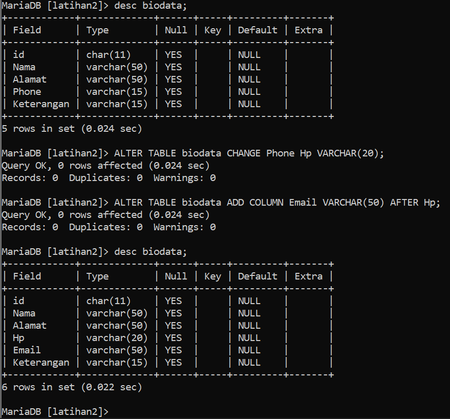
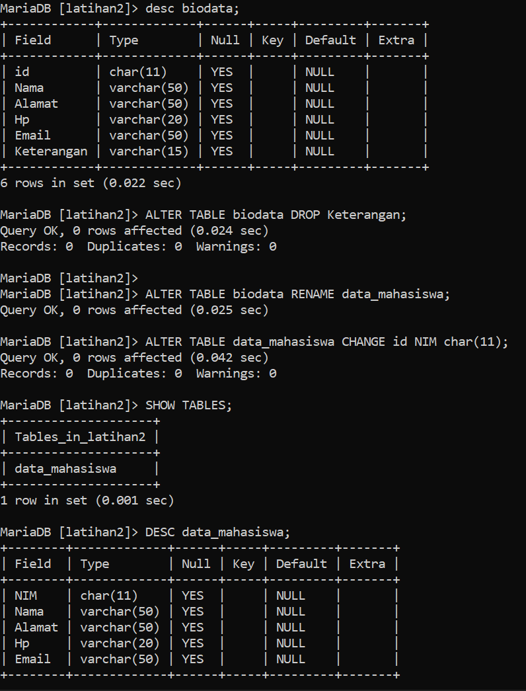
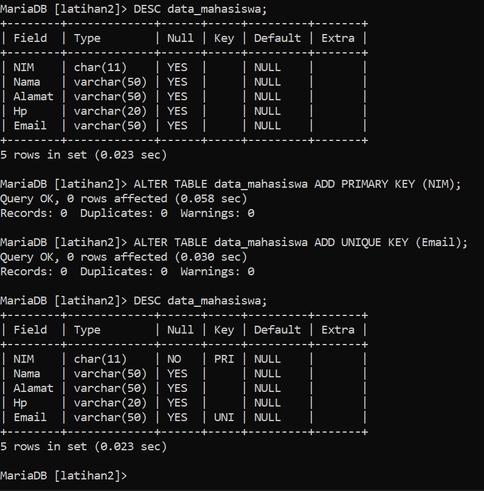

# Latihan2

## Profil
| Variable | Isi |
| -------- | --- |
| **Nama** | ABIDZAR SABIL HANDOYO |
| **NIM** | 312310471 |
| **Kelas** | TI.23.A5 |
| **Mata Kuliah** | Basis data |

# Latihan membuat database, MySQL menggunakan cli

## Tugas Praktikum 

#### 1. Buat sebuah database dengan nama latihan2!

   
   
### Penjelasan:
Gunakan perintah `CREAT DATABASE nama_database;` untuk membuat database baru. 
Dan `SHOW DATABASES;` Untuk melihat database yg kalian punya.

#### 2. Buat sebuah tabel dengan nama biodata (nama, alamat) didalam database latihan1!
#### 3. Tambahkan sebuah kolom keterangan (varchar 15), sebagai kolom terakhir!

   

### Penjelasan:
- `USE latihan2;` Untuk mengunakan databes.
- `CREATE TABLE;` untuk membuat sebuah table.
- `SHOW TABLES;` Berguna untuk melihat table di dalam database. 
- `DESC biodata;` Untuk melihat table yg bernama biodata.

NOTE : VARCHAR(50) berfungsi seperti string, untuk memberi batas 50 kata dalam table. 
 
#### 4. Tambahkan kolom id (int 11) di awal (sebagai kolom pertama)!
 
   

### Penjelasan:
- `ALTER TABLE biodata ADD COLUMN id INT(11) FIRST;` Add field id dengan integer maks 11 angka, di atas Kolom Nama.

#### 5. Sisipkan sebuah kolom dengan nama phone (varchar 15) setelah kolom alamat!

   
   
### Penjelasan:
- `ALTER TABLE biodata ADD COLUMN Phone VARCHAR(15) AFTER Alamat;` Add field Phone dengan VARCHAR(50), setelah kplom Alamat.

#### 6. Ubah tipe data kolom id menjadi char(11)!

   
   
### Penjelasan: 
- `ALTER TABLE biodata MODIFY id CHAR(11);` Mengubah type id dari INT ke CHAR.

#### 7. Ubah nama kolom phone menjadi hp (varchar 20)!
#### 8. Tambahkan kolom email setelah kolom hp.

   

### Penjelasan:
- `ALTER TABLE biodata CHANGE Phone Ph VARCHAR(20);` Ubah field Phone menjadi Ph. 
- `ALTER TABLE biodata ADD COLUMN Email VARCHAR(50) AFTER Hp;` Add Kolom/field Email di bawah Hp.

#### 9. Hapus kolom keterangan dari tabel!
#### 10. Ganti nama tabel menjadi data_mahasiswa!
#### 11. Ganti nama field id menjadi nim!

   

### Penjelasan:
- `ALTER TABLE biodata DROP Keterangan;` Hapus field Keterangan dari table biodata.
- `ALTER TABLE biodata RENAME data_mahasiswa;` Mengganti nama table biodata menjadi data_mahasiswa.
- `ALTER TABLE data_mahasiswa CHANGE id NIM char(11);` Ubah kolom/field id menjadi NIM dengan char/string, maks 11 kata.

#### 12. Jadikan nim sebagai PRIMARY KEY!
#### 13. Jadikan kolom email sebagai UNIQUE KEY

   

### Penjelasan:
- `ALTER TABLE data_mahasiswa ADD PRIMARY KEY (NIM);` Menjadikan data_mahasiswa menjadi PRIMARY KEY.
- `ALTER TABLE data_mahasiswa ADD UNIQUE KEY (Email);` Menjadikan Email sebagai UNIQUE KEY.